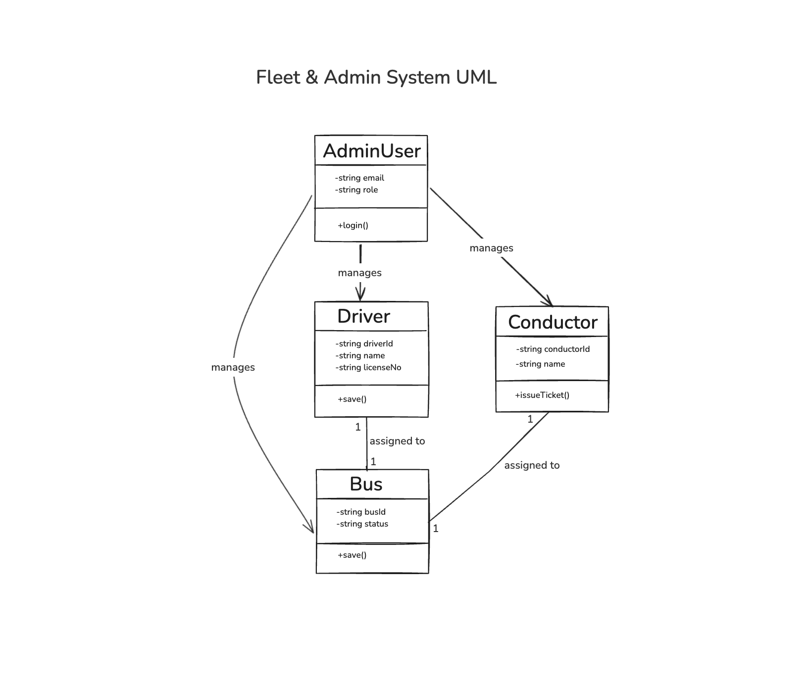
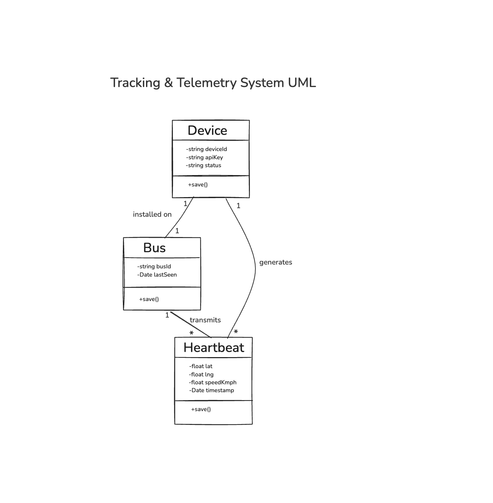
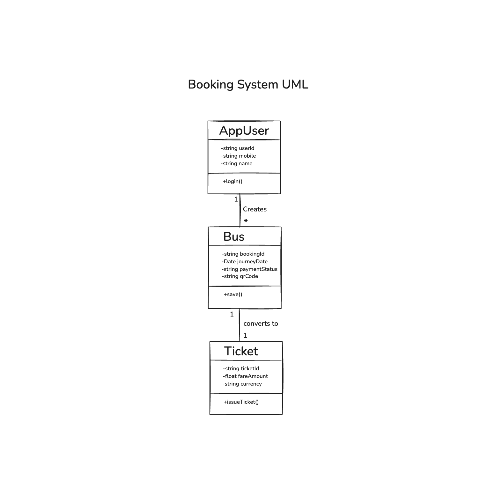
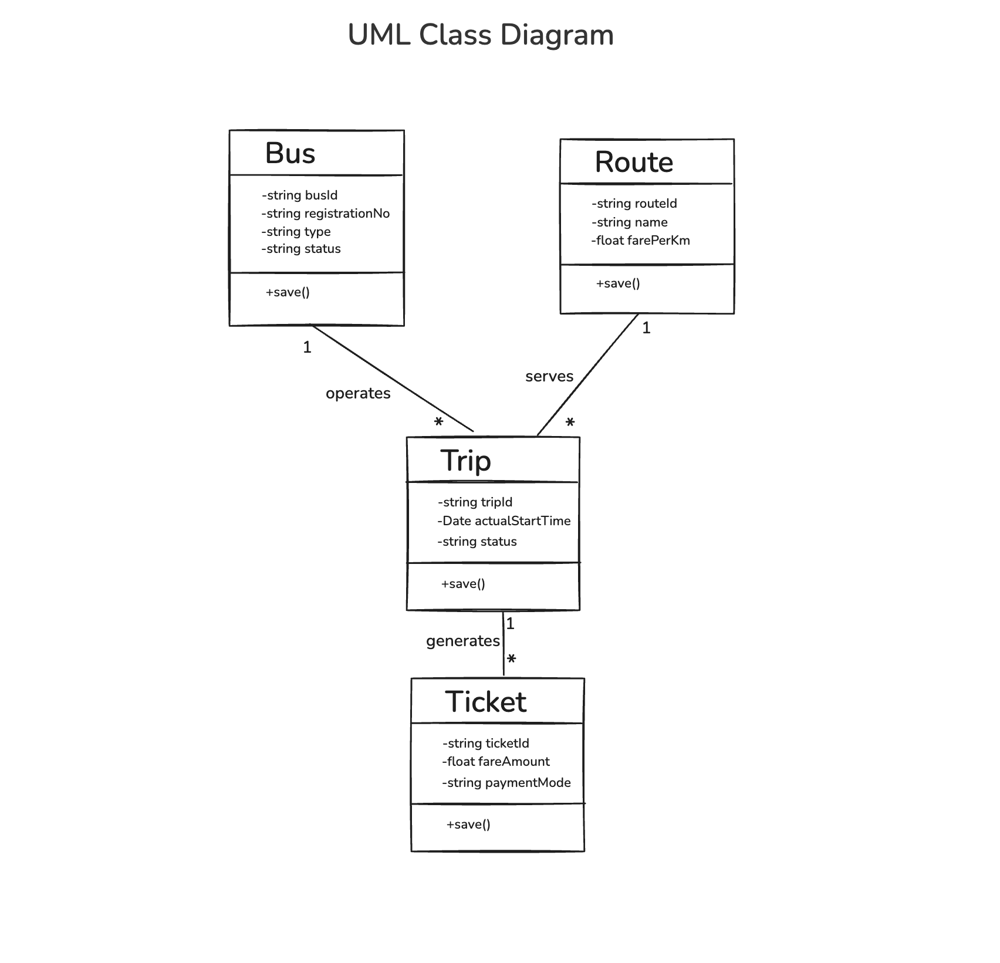

# Class Diagram

## NextStop — Government Bus Tracking & Fleet Management System

---

## 📊 UML Class Diagram (Mermaid)

### 2. Booking System UML

Focuses on how users interact with bookings and payments.

### 3. Fleet & Admin System UML

Focuses on how administrators manage the fleet and personnel.

### 4. Tracking & Telemetry System UML

Focuses on how devices, heartbeats, and buses connect for real-time tracking.

---

## 📋 Class Summary

### Model Layer (14 Classes)

| Class          | Attributes | Key Methods      | Description                        |
|----------------|-----------|------------------|------------------------------------|
| Bus            | 7         | save(), toJSON() | Fleet vehicle entity               |
| Route          | 5         | save(), toJSON() | Transit route with embedded stops  |
| Stop           | 4         | —                | Embedded sub-document in Route     |
| Driver         | 7         | save(), toJSON() | Bus driver personnel               |
| Conductor      | 7         | save(), toJSON() | Bus conductor personnel            |
| Trip           | 12        | save(), toJSON() | Journey lifecycle tracking         |
| Ticket         | 17        | save(), toJSON() | Issued travel ticket               |
| Heartbeat      | 13        | save(), toJSON() | GPS telemetry data point           |
| Device         | 6         | save(), toJSON() | IoT ETM hardware device            |
| AdminUser      | 6         | save(), toJSON() | Admin portal user account          |
| AppUser        | 5         | save(), toJSON() | Passenger mobile app user          |
| UserBooking    | 18        | save(), toJSON() | Passenger booking with QR          |
| BusCapacity    | 4         | save(), toJSON() | Bus seating capacity               |
| OfflineBatch   | 7         | save(), toJSON() | Offline ticket sync batch          |
| VoiceQuery     | 17        | save(), toJSON() | Multilingual voice query           |

### Service Layer (8 Classes)

| Class                  | Methods | Description                          |
|------------------------|---------|--------------------------------------|
| AdminService           | 24      | Admin dashboard business logic       |
| AppService             | 7       | Passenger app business logic         |
| BookingService         | 5       | Booking & QR code logic              |
| ConductorService       | 5       | Conductor operations logic           |
| IngestService          | 5       | ETM data ingestion logic             |
| QRService              | 3       | QR code generation & validation      |
| PassengerLoadService   | 2       | Passenger load estimation            |
| QueryService           | 4       | Data query operations                |
| UploadService          | 2       | File upload & CSV processing         |

### Controller Layer (4 Classes)

| Class                  | Endpoints | Description                       |
|------------------------|-----------|-----------------------------------|
| AdminController        | 12+       | Admin API route handlers          |
| AppController          | 7         | Passenger app route handlers      |
| ConductorController    | 5         | Conductor app route handlers      |
| IngestController       | 5         | ETM data ingestion handlers       |

### Frontend Layer (2 Key Classes)

| Class        | Methods | Description                          |
|--------------|---------|--------------------------------------|
| APIClient    | 20+     | Centralized HTTP client for API      |
| AuthContext  | 3       | Authentication state management      |

---

## 🔗 Relationship Types

| Relationship Type | Symbol | Examples in Project                        |
|-------------------|--------|--------------------------------------------|
| **Composition**   | ◆——    | Route ◆—— Stop (stops exist only in route) |
| **Association**   | ——     | Bus —— Trip, Trip —— Ticket                |
| **Dependency**    | ┈┈▷   | AdminController ┈┈▷ AdminService           |
| **Uses**          | ──▷    | AuthContext ──▷ APIClient                  |

---

## 📝 Notes

1. **Mongoose Document Pattern**: All Model classes extend Mongoose's `Document` interface, inheriting built-in methods like `save()`, `remove()`, `toJSON()`, and `toObject()`.

2. **Service Layer Pattern**: Service classes are implemented as standalone modules with exported functions (not class instances), following Node.js functional patterns while maintaining logical grouping.

3. **Controller as Router**: Controllers in Express.js are implemented as `Router` instances with handler functions, mapped here as classes for UML clarity.

4. **Frontend Components**: React components (DashboardPage, Sidebar, NetworkGraphView, etc.) act as the View layer but are not shown as classes since they are functional components following React's composition pattern.
