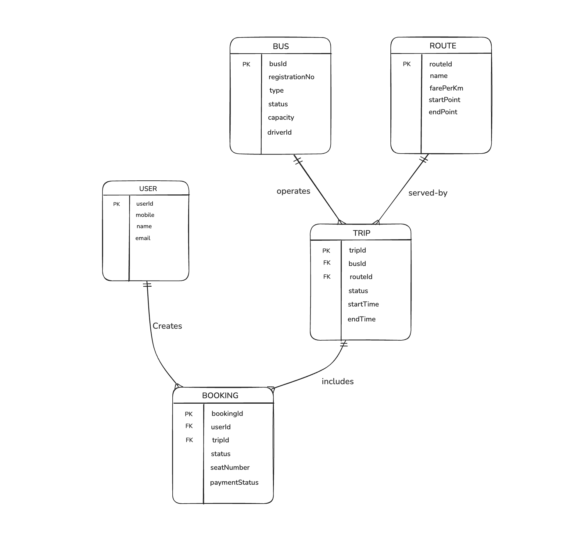

# Entity-Relationship (ER) Diagram

## NextStop — Government Bus Tracking & Fleet Management System

---

## 📊 Core Conceptual ER Diagram (Booking Flow)

---

## 📋 Entity Summary

| Entity   | Description                                  | Primary Key  |
|----------|----------------------------------------------|--------------|
| **Bus**  | Fleet vehicles tracking physical transit ops | `busId`      |
| **Route**| Predefined geographical path for trips       | `routeId`    |
| **Trip** | A specific scheduled journey made by a bus   | `tripId`     |
| **User** | The passenger account using the service      | `userId`     |
| **Booking**| A transaction between a user and a trip    | `bookingId`  |

---

## 🔗 Relationship Summary

| Relationship               | Cardinality | Description                                    |
|----------------------------|-------------|------------------------------------------------|
| Bus **operates** Trip      | 1 : M       | One bus operates many trips over time          |
| Route **served-by** Trip   | 1 : M       | One route is served by many scheduled trips    |
| User **Creates** Booking   | 1 : M       | One passenger can create many bookings         |
| Trip **includes** Booking  | 1 : M       | One trip includes many passenger bookings      |

---

## 📝 Notes

1. **Focus**: This diagram represents the core conceptual data model focused strictly on the bus-trip-booking cycle, abstracting away the IoT, telemetry, and employee (driver/conductor) tables for clarity.
2. **Implementation**: While this ER diagram follows relational conventions, the actual database backend uses MongoDB. Relationships are implemented via string-based foreign keys (e.g., `busId`, `routeId`) rather than strict relational integrity constraints.
