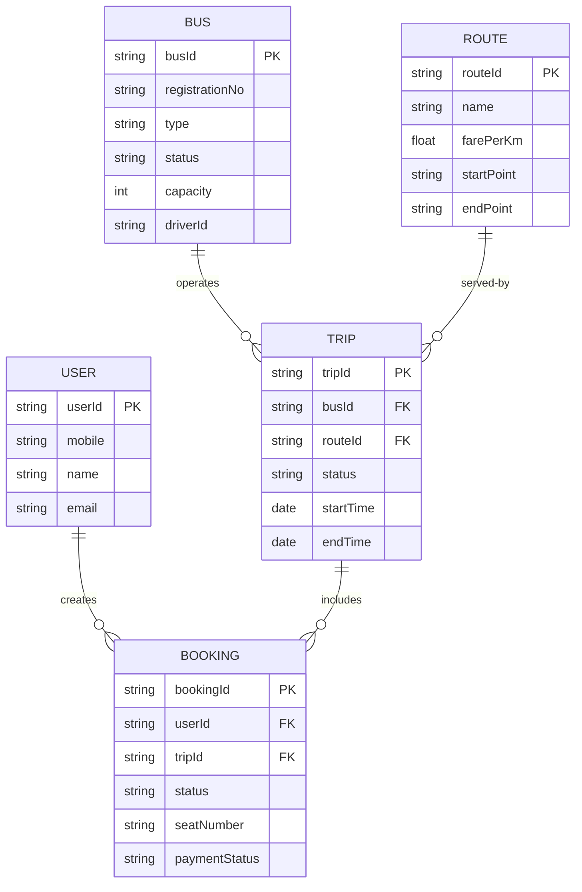

# Entity-Relationship (ER) Diagram

## NextStop — Government Bus Tracking & Fleet Management System

---

## 📊 ER Diagram (Mermaid)

---

## 📋 Conceptual Entity Summary

| Entity   | Role in System                               | Primary Key  |
|----------|----------------------------------------------|--------------|
| **Bus**  | The physical vehicle operating the trips.    | `busId`      |
| **Route**| The predefined path the bus travels.         | `routeId`    |
| **Trip** | A specific journey made by a Bus on a Route. | `tripId`     |
| **User** | The passenger booking travel tickets.        | `userId`     |
| **Booking**| The transaction/ticket for a User on a Trip. | `bookingId`  |

---

## 🔗 Core Flow

1. A **Bus** is assigned to **operate** a **Trip**.
2. That **Trip** serves a specific **Route**.
3. A **User** creates a **Booking**.
4. That **Booking** is linked to that specific **Trip**.

---

## 📝 Notes

1. **MongoDB Document Model**: While this ER diagram follows relational conventions, the actual database uses MongoDB (NoSQL). Relationships are implemented via string-based foreign keys (e.g., `busId`, `routeId`) rather than traditional SQL foreign key constraints.

2. **Embedded Documents**: The `Stop` entity is embedded within the `Route` document as a sub-document array, leveraging MongoDB's document model for co-located data access.

3. **Denormalization**: Some fields like `busId` appear in multiple collections (Trip, Ticket, Heartbeat) for query performance — a common MongoDB pattern.

4. **Compound Indexes**: Several collections use compound indexes (e.g., `Ticket: {tripId, issuedAt}`, `Heartbeat: {busId, timestamp}`) for optimized query performance on frequently accessed data patterns.
