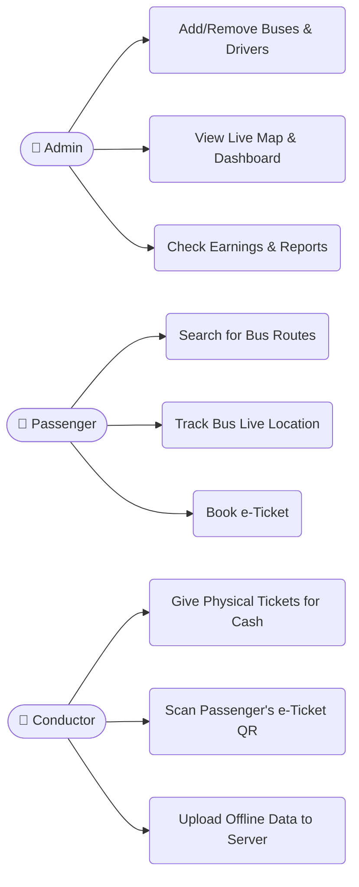

# Use Case Diagram

## Project: NextStop — Government Bus Tracking 

A **Use Case Diagram** simply shows "who does what" in the system. It connects the users (Actors) to the actions they can perform (Use Cases).

Overall, we have 3 main humans using the system:
1. **Admin**: Manages everything from the big office.
2. **Passenger**: Travels on the bus and uses the mobile app.
3. **Conductor**: Issues tickets on the actual bus using a machine.

---

## 📊 Visual Diagram

---

## 📋 What each user can do (Explained simply)

### 1. The Admin (Office Manager)
- **Add/Remove Buses & Drivers**: Can register new buses or hire new drivers in the system's database.
- **View Live Map & Dashboard**: Can look at the main screen to see where all the buses are currently driving.
- **Check Earnings & Reports**: Can see how many tickets were sold and how much money the government made today.

### 2. The Passenger (Traveler)
- **Search for Bus Routes**: Can open the mobile app and find buses going from Point A to Point B.
- **Track Bus Live Location**: Can see exactly where their bus is on the map so they don't miss it.
- **Book e-Ticket**: Can buy a ticket online using the app and get a QR code on their phone.

### 3. The Conductor (Bus Staff)
- **Give Physical Tickets for Cash**: Uses the handheld ticketing machine (ETM) to print tickets for people who pay with cash.
- **Scan Passenger's e-Ticket QR**: Scans the passenger's mobile phone to confirm they already paid online.
- **Upload Offline Data to Server**: If the bus travels through an area with no internet, the machine saves ticket data. When the internet comes back, the conductor pushes a button to upload it all to the server safely.
