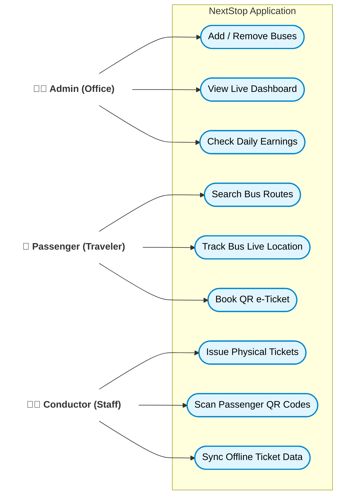

# Use Case Diagram

## Project: NextStop — Government Bus Tracking 

This diagram visually represents the **Actors** (the people using the system) standing on the outside, and arrows pointing toward their specific **Use Cases** (the actions they take) inside the application boundary.

---

## 📊 Visual Diagram

---

## 📋 Simple Explanation

This is the classic way to read this diagram:
- The **System Boundary** (the big box labeled "NextStop Application") represents everything inside our software.
- The **Actors** (the people on the left) interact with the software from the outside.
- The **Arrows** point exactly to what each person is allowed to do.

### Actors & Actions Breakdown:

1. **👨‍💼 Admin**: Sits in the back-office. They have the power to **manage the fleet** (buses and drivers), watch the **live tracking dashboard**, and review the **daily revenue**.
2. **🧍 Passenger**: Uses the system on their mobile phone. They mainly want to **find where the bus is**, **track it in real-time**, and **buy a digital ticket**.
3. **👨‍✈️ Conductor**: Operates on the physical bus. They use a hand-held machine to **print out tickets**, **scan tickets** bought by passengers digitally, and **upload** all that offline data to the server when they reach the depot.
